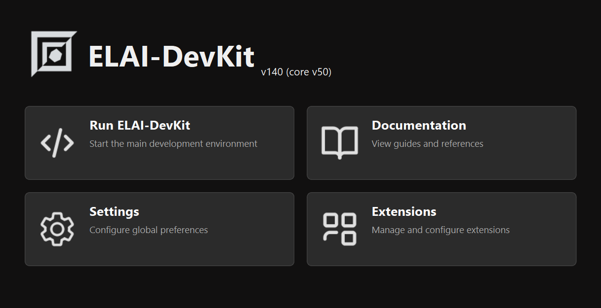
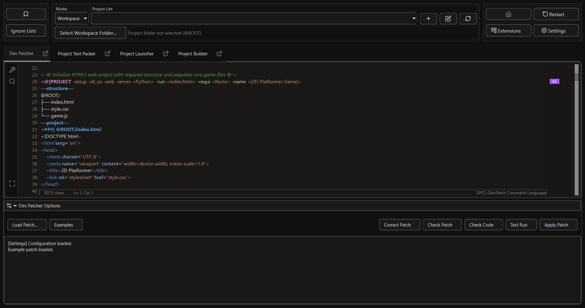
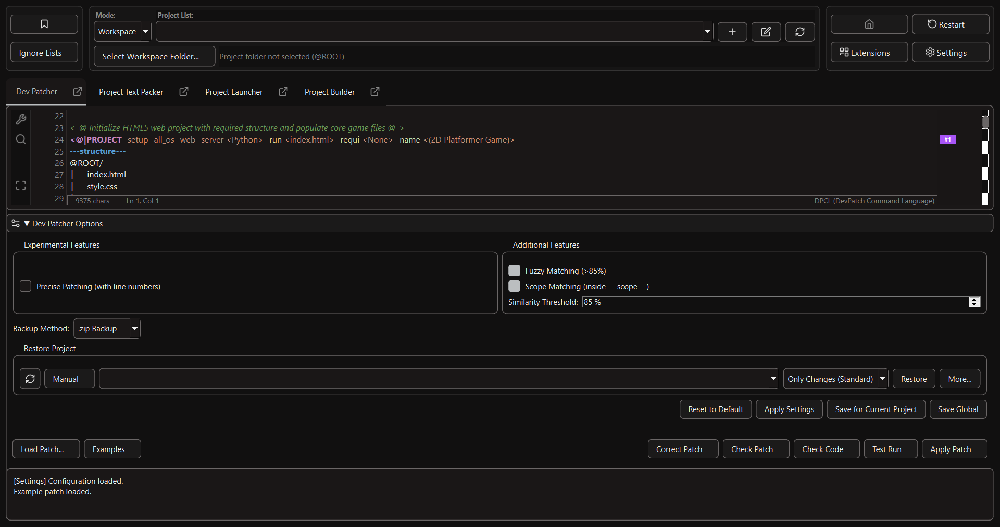
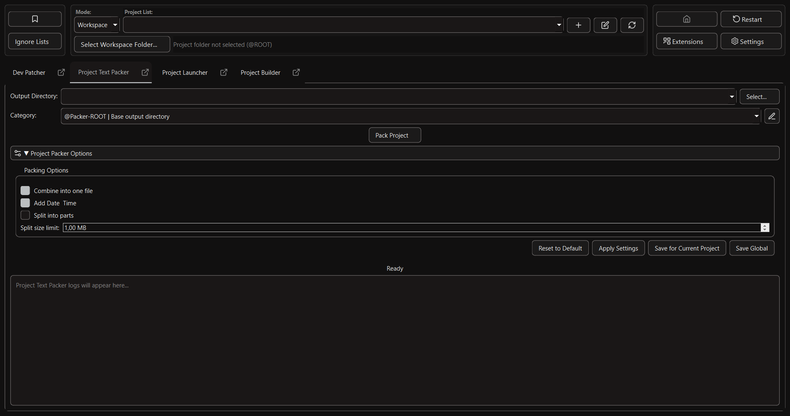
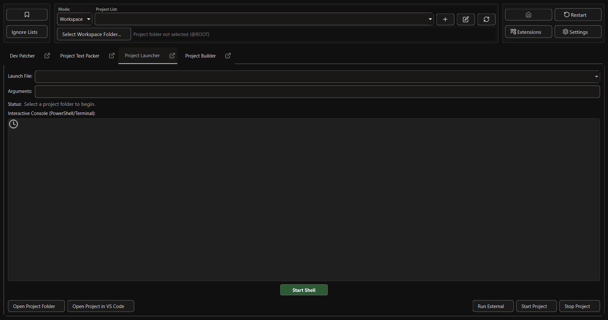
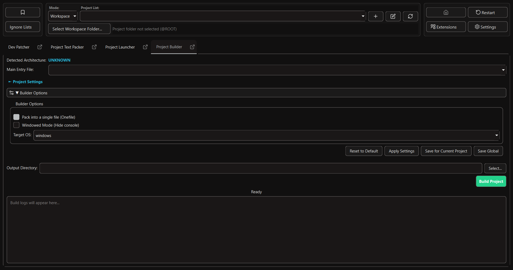
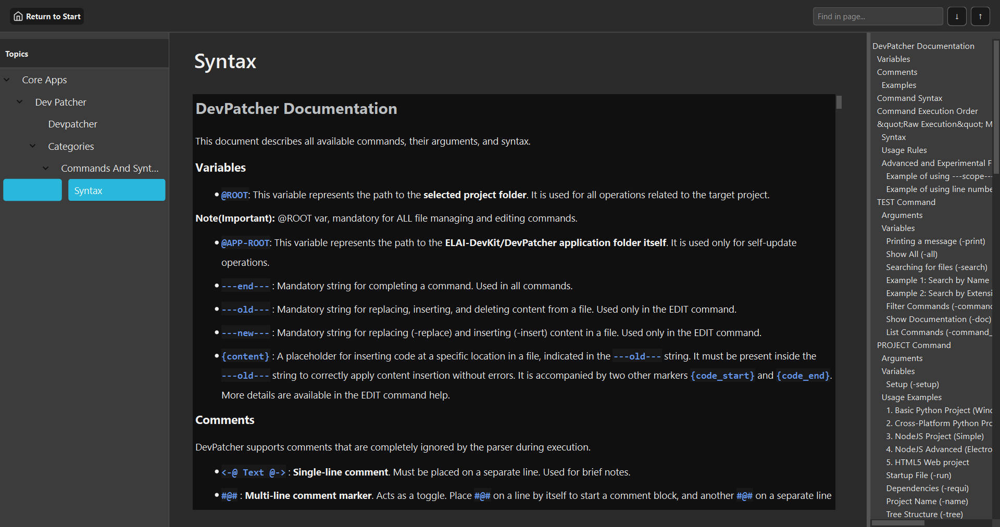
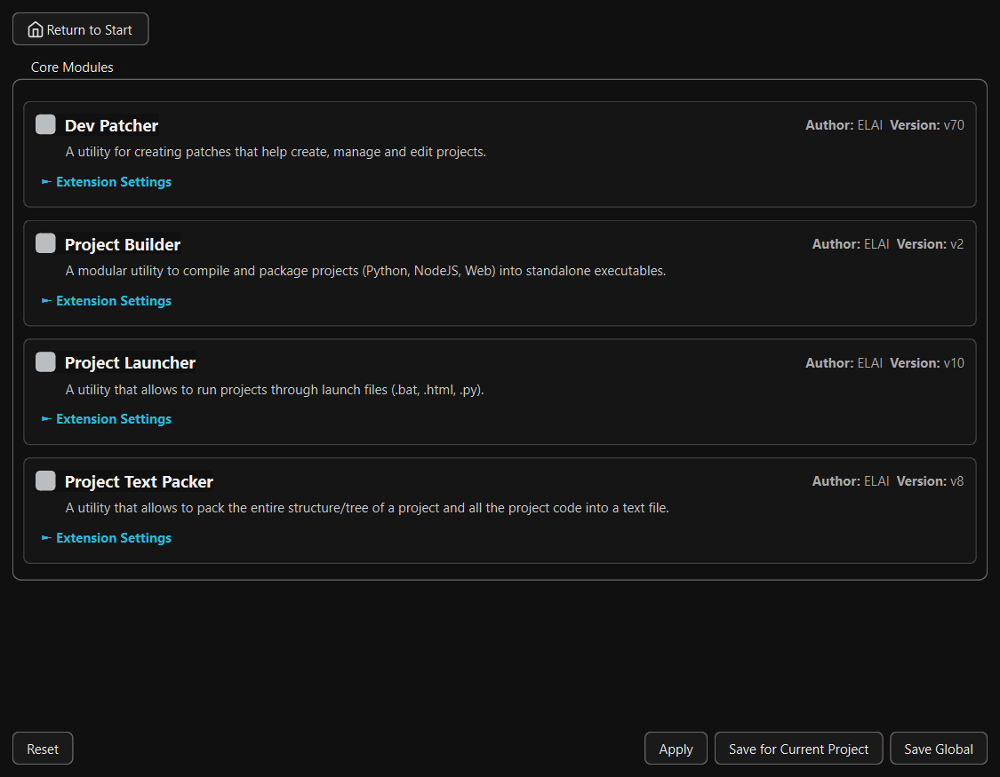

# ELAI-DevKit

<div align="center">


**Experimental AI-Assisted Development Toolkit**

[](https://python.org)
[](LICENSE)
[](README.md)
[](version.txt)





</div>

## 🎯 Overview

**ELAI-DevKit** is an experimental toolkit born from a simple concept: *What if you could build entire software projects through AI chats without manually creating folder structures, copy-pasting code, or hunting for specific lines to edit?*

Developed entirely from scratch through AI chat interactions (spanning models from Gemini 2.5 Pro to 3.1 Pro), this project is designed to bridge the gap between AI-generated code and your local file system. ELAI-DevKit acts as a collection of tools for automating the development lifecycle: from simulating and testing patches to applying changes and packing project context for the next iteration.

### 💭 Core Philosophy: Iterative Patching vs. Autonomous Agents

Unlike autonomous AI agents or fully automated "vibe coding" tools that attempt to write entire applications at once (often hitting context window limits or output restrictions), ELAI-DevKit champions a structured, **iterative patch-based workflow**. 

Because free web-based AI chat models have limited output sizes, the most effective approach for complex software is sequential editing. You build your project step-by-step. This methodical approach gives you significantly more control, resulting in better architecture and fewer hallucinations compared to fully autonomous tools. ELAI-DevKit itself is the best proof of this concept, as its extensive functionality was built primarily using its own patching system.

Furthermore, this workflow allows developers to leverage high-quality, free-tier AI web chats, making it a highly cost-effective alternative to expensive API-based coding agents or paid subscriptions.

## 📥 Installation

Welcome to the **ELAI-DevKit** installation guide. The toolkit provides automated scripts to make the setup process as smooth as possible on both Windows and Unix-based systems (Linux/macOS).

### 1. Clone the Repository

First, clone the repository to your local machine:
```bash
git clone https://github.com/ELAI-Dev-Works/ELAI-DevKit.git
cd ELAI-DevKit
```

### 2. Install Prerequisites (Optional but Recommended)

ELAI-DevKit requires **Python 3.11+** and the **uv** package manager as its core dependencies. **Node.js** and **Git** are also highly recommended for full functionality (especially for the Project Launcher and Web/NodeJS project modes).

If you don't have these installed, you can use the helper scripts located in the `install/` directory.

**For Windows:**
Navigate to the `install\win\` folder and run the desired `.bat` files. They utilize Windows Package Manager (`winget`) or provide direct download links:
- `uv.bat` - Installs the `uv` package manager (Crucial for fast dependency resolving).
- `python.bat` - Installs Python.
- `nodejs.bat` - Installs Node.js.
- `git.bat` - Installs Git.

**For Linux/macOS:**
Navigate to the `install/linux_mac/` folder and run the `.sh` scripts:
```bash
chmod +x install/linux_mac/*.sh
./install/linux_mac/uv.sh
./install/linux_mac/python.sh
./install/linux_mac/nodejs.sh
./install/linux_mac/git.sh
```

### 3. Check Environment and Setup

Once the prerequisites are installed, use the environment checking script. This script will automatically create a virtual environment (`.venv`), synchronize all required Python dependencies via `uv`, and run initial diagnostics to ensure everything is working correctly.

**For Windows:**
```cmd
check_environment.bat
```

**For Linux/macOS:**
```bash
chmod +x check_environment.sh
./check_environment.sh
```
*Note: This script will verify that `uv` is in your PATH, check for `node`/`npm`, create the `.venv`, run `uv pip sync requirements.txt`, and execute the built-in diagnostic tool.*

### 4. Launch the Application

After a successful environment check, you are ready to start ELAI-DevKit!

**For Windows:**
```cmd
run.bat
```

**For Linux/macOS:**
```bash
chmod +x run.sh
./run.sh
```
This will initialize the toolkit and open the launch window.

## Key Features & Interface Guide

ELAI-DevKit is designed with a user-friendly Qt-based interface that provides several powerful features out of the box.

### Interface Tooltips
To help you navigate the various options and settings, the interface features an integrated tooltip system. 
*   **Hover for Info:** Most buttons and settings have a built-in tooltip. Hover over an element (or its `?` icon) to see a detailed explanation of its function.
*   **Always Show Icons:** You can configure the UI to always display these tooltip icons next to their respective elements via the **Main Settings > UI** menu.

### Ignore Lists (Backup & Packing)
When creating backups or packing your project context for the AI, you often want to exclude large or sensitive files (like `.venv`, `node_modules`, or `.env`). ELAI-DevKit provides a robust Ignore List system (accessible via the "Ignore Lists" button in the top bar):
*   **Global & Temporary Lists:** Define a global ignore list that applies to all projects, as well as a temporary list for the current session.
*   **.gitignore Integration:** Instruct the toolkit to automatically read and apply your project's `.gitignore` file.
*   **Context Tags:** You can selectively ignore files for specific tools using tags. For example:
    *   `node_modules` — Ignored everywhere.
    *   `dist[!packer]` — Ignored only by the Project Text Packer.
    *   `build [!git][!packer]` — Ignored for Git commits and the Packer, but included in standard ZIP backups.

### Extensions & Modularity
The toolkit is highly modular. Core features (like the Dev Patcher, Project Launcher, and Text Packer) are actually built as extensions. 
*   You can enable, disable, and configure extensions via the **Extensions Manager** (accessible from the main Launch screen).
*   Developers can create their own custom commands and UI modules to expand the toolkit's capabilities without modifying the core code.

### Diagnostics & Extra Tools
*   **Diagnostics:** If something goes wrong, you can run `diagnostic.bat` (Windows) or `diagnostic.sh` (Linux/macOS) to verify your Python version, dependencies, and syntax parser.
*   **Extra Tools:** The `extra_tools.bat` / `extra_tools.sh` scripts provide a menu for additional helpful scripts, such as a System Prompt Builder to help you customize the instructions sent to the AI.

### Automated Backup System & Restoration
To protect your project from AI hallucinations, logical errors, or bad syntax, DevPatcher includes an automated backup system that triggers *before* any patch is applied.
*   **.zip Backups:** Archives your project folder and saves it in the **parent directory** of your project (e.g., `../ProjectName_backup_2026-04-23_10-15.zip`). Saving outside the project folder prevents nested backup loops and keeps your workspace clean.
*   **Git Commits:** If enabled, it automatically initializes a Git repository (if one doesn't exist) and creates a commit of your current working tree before applying changes.
*   **Restoration:** You can restore previous states directly from the DevPatcher "Quick Settings" panel. The system supports "Only Changes" mode (rolling back only the specific files the patch modified) or "Full Replace" mode (extracting the entire ZIP archive over your directory).

## Core Applications & Modules

ELAI-DevKit is built as a modular ecosystem. Here is an overview of the main tools included by default:

### 1. DevPatcher
The heart of the toolkit. It reads AI-generated patches (using its specific DPCL syntax), simulates the changes in a virtual file system to detect conflicts, checks the code for syntax errors, and securely applies them to your local drive.
*   **Key Features:** Fuzzy matching (>85% similarity threshold), AST-based structural refactoring (`REFACTOR` commands), automatic patch syntax correction, and an interactive visual diff viewer before applying changes.


*(Advanced Options View)*


### 2. Project Text Packer
Converts your entire project (or selected parts) into a single, AI-readable text file containing both the directory tree and the source code.
*   **Key Features:** Builds an elegant ASCII directory tree, numbers lines for precise patching, and automatically splits output into multiple parts if the context exceeds a specified megabyte limit. Highly respectful of `.gitignore` and global ignore lists.



### 3. Project Launcher
An intelligent runner that automatically detects how to execute your project based on its files (`.py`, `.js`, `index.html`, etc.).
*   **Key Features:** Built-in interactive PTY console (PowerShell/Bash) to interact with scripts directly in the UI, external terminal launch support, and auto-generation of cross-platform `run.bat`/`run.sh` bootstrap scripts.



### 4. Project Builder
Compiles your source code into standalone, distributable executables.
*   **Key Features:** Auto-detects the project architecture and uses the appropriate compiler: `PyInstaller` (for Python), `pkg` (for Node.js), and `Electron Packager` (for Web/HTML5). Allows setting custom icons, hiding the console (windowed mode), and packing into a single file.




## Quick Start: Your First AI-Driven Project

Once you have launched ELAI-DevKit, you will be greeted by the main Launcher window. Click **Run ELAI-DevKit** and select an empty folder where you want your new project to reside.

### 1. Preparing the AI Context
In your ELAI-DevKit root folder, you will find a file named `DevPatcherDocsAndInstruction.txt` *(Note: This file may be renamed in future versions)*. This file is your **System Prompt**. It contains all the rules, command syntax, and behavioral instructions the AI needs to generate valid patches for the toolkit.

### 2. Choosing the Right AI Model
Not all AI models are created equal when it comes to following strict syntax rules. Based on extensive testing, here is a breakdown of model performance for ELAI-DevKit:

*   **Recommended Models(on Free Tiers AI Chats):**
    *   **Gemini (Pro Models via Google AI Studio):** Highly capable and understands instructions well. *Note: Avoid "Flash" models as they often confuse the patcher syntax; forcing them to work would require overly detailed instructions that consume too much of your context window. Occasional bugs may happen even on Pro models, but they are generally reliable.*
    *   **Claude Opus (v4.6)(tested on Antigravity app with Free Plan):** Consistently good at following formatting rules and understanding project architecture.
    *   **DeepSeek (Expert/Reasoner Mode):** Exceptional at understanding instructions and generating precise, flawless patches.
    *   **Qwen 3.6 Plus:** Shows a decent understanding of the instructions, though occasional minor syntax bugs may occur.
    *   **GLM (5, 5.1):** Understands the logic well(sometimes clarifications on commands and instructions are required), but its web interface is currently problematic (There is no normal codeblocks, which is why standard copying from the chat also copies the response text, requiring manual cleanup before pasting into DevPatcher).
    *   **Kimi K2.6:** Currently experiencing website stability issues; it has not been fully evaluated yet.
*   **Local Models:**
    *   Not officially tested yet. In the future, ELAI-DevKit may introduce a dedicated mode for local models using structured outputs (e.g., GBNF grammar or strict JSON) and a smart context-gathering tool to compensate for smaller context windows.

### 3. Generating the Project
1. Open your chosen AI chat.
2. Upload or paste the contents of `DevPatcherDocsAndInstruction.txt` as a System Prompt or as your first message.
3. Send a prompt like: *"I want to create a simple Python web server. Please generate a setup patch."*
4. The AI will output a patch using the `<@|PROJECT -setup ...` command. Copy this code block.

### 4. Using the DevPatcher Interface
Navigate to the **Dev Patcher** tab in ELAI-DevKit.

1. **Paste:** Paste the AI's output into the main code editor window.
2. **Check Patch (Simulation):** Click this button first. It runs a dry-run in a virtual file system to ensure the patch is syntactically correct and won't corrupt your project. Read the log output to confirm it says "SUCCESS".
3. **Check Code (Optional):** Validates the actual programming syntax of the generated code (Python, JS, HTML, etc.) before applying it to your drive.
4. **Apply Patch:** If everything is green, click this button. DevPatcher will automatically back up your project (via ZIP or Git) and securely apply the files to your folder.

### 5. Launching Your Project
Switch to the **Project Launcher** tab.
*   The toolkit automatically scans for runnable files in your project directory. Select your main entry point from the dropdown (e.g., `main.py` or `run.bat`).
*   Click **Start Project**. The application will run in the interactive terminal console at the bottom of the screen.

### 6. Iterating and Updating (Context Packing)
Software development is an iterative process. When you want to add a new feature, refactor code, or fix a bug:
1. Switch to the **Project Text Packer** tab.
2. Click **Pack Project**. This tool intelligently scans your project, ignores unnecessary build files or dependencies (like `.venv` or `node_modules`), and creates a `_project_pack.txt` file containing your entire project structure and code.
3. Upload this pack file back to your AI chat along with your new request: *"Here is the current project state. Please add a new endpoint to my server."*
4. The AI will generate an `<@|EDIT ...` or `<@|MANAGE ...` patch. Paste it into DevPatcher, Simulate, and Apply!

<div align="center">

## 📸 Screenshots

### Main Interface

<div align="center">

**Launch Screen**


The main launch interface provides quick access to all components.

---

**DevPatcher**


The DevPatcher interface with patch editor and execution controls.

---

**DevPatcher with Options**


Advanced patching options including backup system, additional checkboxes for automation of execution simulation, code checking, and experimental features for DevPatcher.

---

**Project Builder**


Configure and build executables for multiple platforms.

---

**Project Launcher**


Launch and manage your projects with integrated terminal.

---

**Project Text Packer**


Pack project context for AI language models.

---

**Documentation**



Built-in documentation browser with search and navigation.

---

**Extensions Manager**



Manage and configure extensions and custom modules.

</div>

## 📄 License

This project is licensed under the **Apache License 2.0** - see the [LICENSE](LICENSE) file for details.

```
Copyright 2026 ELAI-DevWorks

Licensed under the Apache License, Version 2.0 (the "License");
you may not use this file except in compliance with the License.
You may obtain a copy of the License at

    http://www.apache.org/licenses/LICENSE-2.0

Unless required by applicable law or agreed to in writing, software
distributed under the License is distributed on an "AS IS" BASIS,
WITHOUT WARRANTIES OR CONDITIONS OF ANY KIND, either express or implied.
See the License for the specific language governing permissions and
limitations under the License.
```

---

**Made with ❤️ using ELAI-DevKit**

[Back to Top](#elai-devkit)

</div>